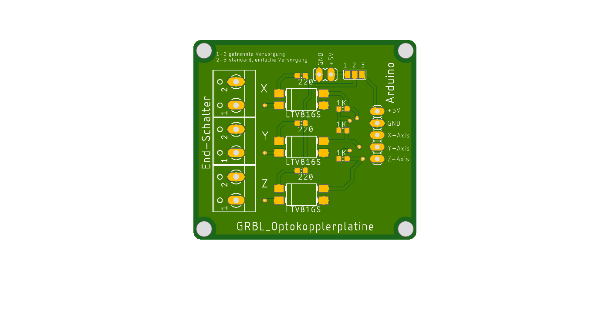
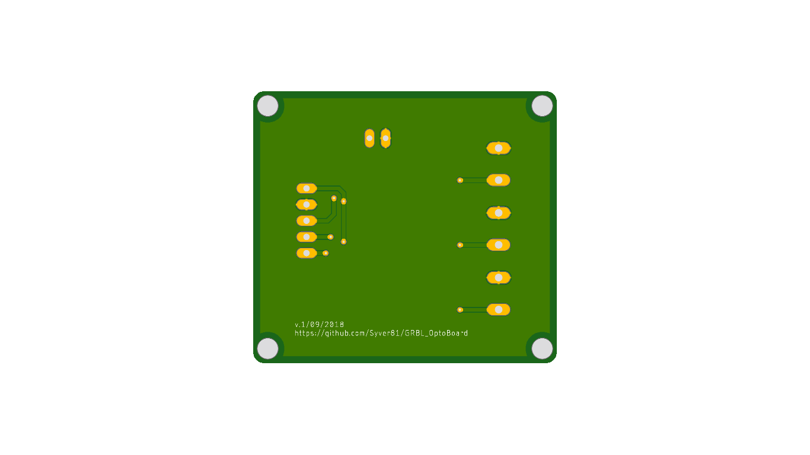

# GRBL_OptoBoard

Based on the schematics from https://github.com/gnea/grbl/wiki/Wiring-Limit-Switches, here with mostly smd parts. 
You can order the PCB on Aisler https://aisler.net/p/MWZMTXNJ. 

To power the hole PCB over one 5V connection, make a bridge between pad 2 and 3. For seperate power on the left side, use the additional connectors on the top and make a bridge between pad 1 and 2.

